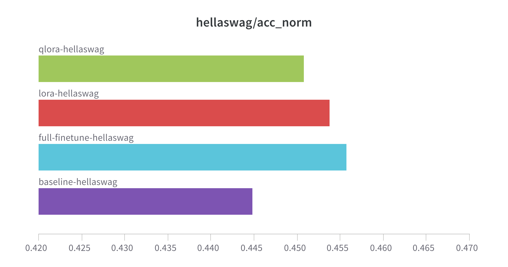

# Fine-Tuning and Evaluating HuggingFaceTB/SmolLM2-135M on HellaSwag

## Overview

This project explores different fine-tuning approaches for the **HuggingFaceTB/SmolLM2-135M** model on the **HellaSwag** benchmark. The goal was to compare the effectiveness of:

- **Full fine-tuning** (training all model parameters)
- **LoRA fine-tuning** (Low-Rank Adaptation)
- **QLoRA fine-tuning** (Quantized Low-Rank Adaptation)

After fine-tuning, the models were evaluated using the **lm-harness-evaluation** benchmark to assess performance.

## Methodology

We chose to adopt a small model (135M) so as to be able to fully fine tune it as well and compare the results. The purpose of this study is not to achieve state of the art results but merely to check that lora and qlora do not deteriorate finetuning

We chose one popular downstream task for simplicity.

In every case, training was performed until convergence of the train loss

The decision to quantize only the q and v matrices is arbitrary but consistent with the experiments performed in the qlora paper

### Hyperparameter setting

For consistency, we chose the same LoRA hyperparameters for LoRA and qLoRA finetuning, setting them to values used in the literature. Namely, the rank was set to 8 and alpha to 32.

The other training hyperparameters were set according what the NVIDIA GeForce GTX 1080 Ti used for finetuning allowed us to do and what worked best.

## Dataset: HellaSwag

HellaSwag is a **commonsense reasoning** dataset designed to challenge language models with multiple-choice questions. Each example contains:

- **A context**
- **Four possible endings (A, B, C, D)**
- **A correct answer label**

Fine-tuning aimed to improve the model's ability to select the correct ending based on the context.

## Fine-Tuning Approaches

### **1. Full Fine-Tuning**

In full fine-tuning, all model parameters were updated. This provides the highest flexibility but requires significant computational resources.

### **2. LoRA Fine-Tuning**

**LoRA (Low-Rank Adaptation)** is a parameter-efficient fine-tuning method that injects trainable low-rank matrices into the model’s **attention layers**, keeping the base model frozen. This reduces computational cost while maintaining performance.

### **3. QLoRA Fine-Tuning**

**QLoRA (Quantized Low-Rank Adaptation)** builds on LoRA by applying **4-bit quantization** to the model, further reducing memory usage. It enables fine-tuning of large models on consumer GPUs while preserving model quality.

## Implementation

- The **transformers** library was used for model loading and fine-tuning.
- **LoRA and QLoRA** were implemented using the **peft** library.
- Training was performed with the **Trainer API**.
- Model evaluation was done using **lm-harness-evaluation**.

## Evaluation

The fine-tuned models were evaluated using **lm-harness-evaluation**, a framework that measures language model performance across tasks.

The task chosen was the hellaswag benchmark

## Results & Observations

- **Full fine-tuning** achieved the best accuracy but required the most memory.
- **LoRA fine-tuning** performed similarly while using fewer resources.
- **QLoRA fine-tuning** showed a minor drop in accuracy but significantly reduced GPU memory usage, making it ideal for limited hardware.

## Conclusion

Overall, a full finetuning of the SmolLM2-135M model can improve the result by over 1pt on the benchmark, which is roughly what one should expect from a model of this size.

LoRA finetuning yielded similar results

## References

- Hugging Face Transformers: <https://huggingface.co/docs/transformers>
- HellaSwag Dataset: <https://rowanzellers.com/hellaswag/>
- lm-harness-evaluation library: <https://github.com/EleutherAI/lm-evaluation-harness/tree/main#model-apis-and-inference-servers>
- SmolLM2 model card: <https://huggingface.co/HuggingFaceTB/SmolLM2-135M>

- LoRA Paper: <https://arxiv.org/abs/2106.09685>
- QLoRA Paper: <https://arxiv.org/abs/2305.14314>
